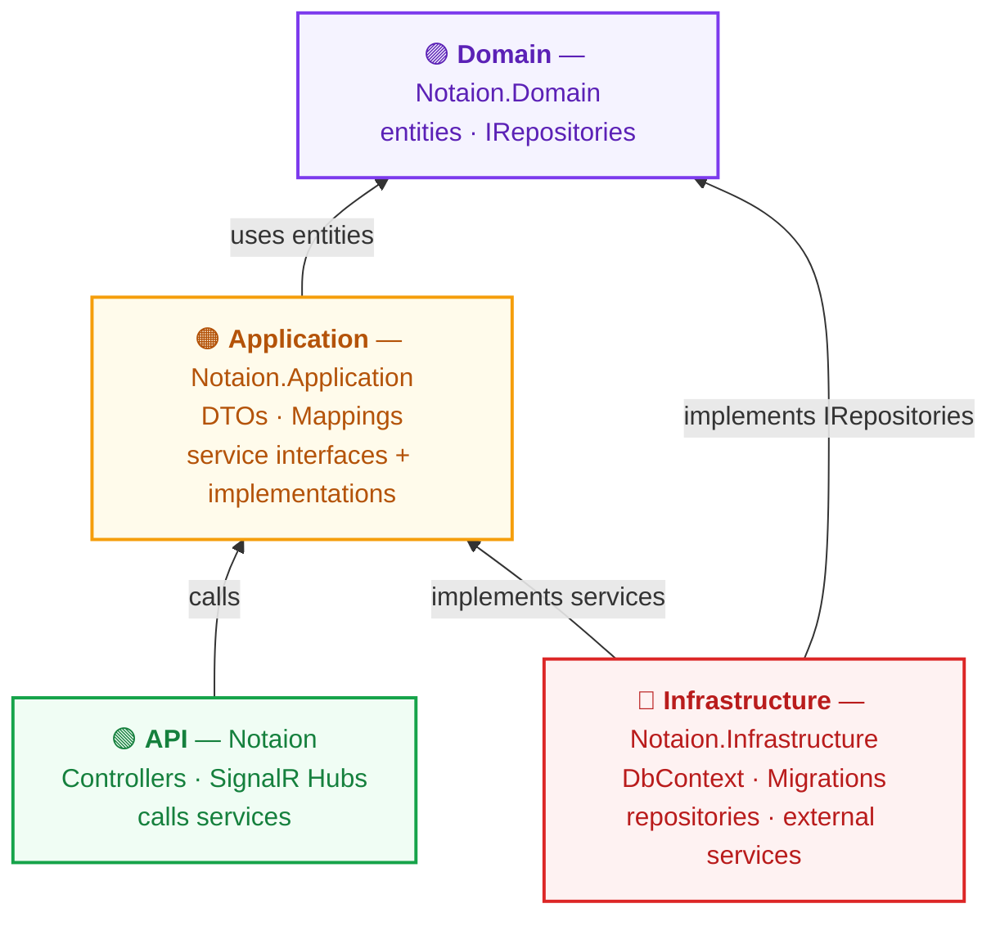
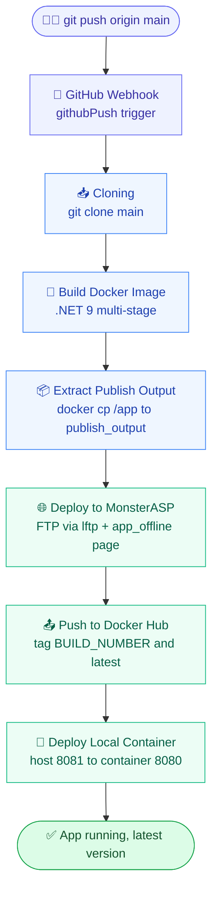

🌐 **English** | [Tiếng Việt](README.vi.md)

# 🗒️ Notaion Backend

> A Notion-inspired real-time **notes & chat** platform — an **ASP.NET Core 9** Web API built on **Clean Architecture**, containerized with **Docker** and shipped through a **Jenkins** CI/CD pipeline.

[](https://coderabbit.ai)
[](https://github.com/mtai0524/notaion-backend/actions/workflows/main_my-chat-console.yml)


---

## ✨ Features

- 📝 **Notion-style pages** — nested pages, items and page-visit tracking
- 📅 **Daily notes** with real-time collaboration and pasted image/file attachments
- 💬 **Real-time chat** — group rooms and private conversations over SignalR
- 👥 **Friends** — friend requests and friendships
- 🔔 **Notifications** pushed in real time
- 🤖 **AI chatbot & memory** powered by ML.NET
- 📎 **File & image uploads** via Cloudinary
- 🔐 **Auth** — ASP.NET Identity, JWT Bearer, OpenID Connect and **Discord** OAuth (link/unlink providers)
- 📊 **Analytics** and 🩺 **health checks**

---

## 🏛️ Clean Architecture

Dependencies always point **inward**: outer layers depend on inner ones, and the **Domain** at the core depends on nothing.



| Layer | Project | Responsibility |
|---|---|---|
| 🟣 **Domain** | `Notaion.Domain` | Entities, enums and repository interfaces (`IRepositories`). The core — depends on nothing. |
| 🟠 **Application** | `Notaion.Application` | Use cases: DTOs, mappings, service interfaces and their implementations. |
| 🔴 **Infrastructure** | `Notaion.Infrastructure` | `DbContext`, EF Core migrations, repository + external-service implementations, Identity. |
| 🟢 **API** | `Notaion` | HTTP controllers, SignalR hubs, filters — the entry point that wires everything together. |

<details>
<summary>📷 Original hand-drawn diagram (source of the Mermaid above)</summary>


</details>

---

## 🧱 Project Structure

```
NotaionWebApp/
├── Notaion/                       # 🟢 API — Controllers, SignalR Hubs, Filters, Attributes
├── Notaion.Application/           # 🟠 Application — Services, Interfaces, DTOs, Mappings, Hubs
├── Notaion.Domain/                # 🟣 Domain — Entities, Enums, Interfaces (IRepositories)
├── Notaion.Infrastructure/        # 🔴 Infrastructure — DbContext, Migrations, Repositories, Identity
├── Notion.Aspire.AppHost/         # .NET Aspire orchestration host
└── Notion.Aspire.ServiceDefaults/ # Shared Aspire service defaults
```

---

## 🛠️ Tech Stack

| Area | Technology |
|---|---|
| Runtime | .NET 9 · ASP.NET Core Web API |
| Real-time | SignalR (chat & daily-note hubs) |
| Data | EF Core 9 · SQL Server |
| Auth | ASP.NET Identity · JWT Bearer · OpenID Connect · Discord OAuth |
| AI / ML | Microsoft.ML (ML.NET) |
| Media | Cloudinary |
| API docs | Swagger · NSwag · Scalar |
| Orchestration | .NET Aspire |
| Container | Docker (multi-stage) |
| CI/CD | Jenkins (primary) · GitHub Actions |

---

## 🚀 CI/CD

Every push to `main` triggers the **Jenkins** pipeline (via a GitHub webhook), which builds a Docker image, deploys it to **MonsterASP.NET** over FTP, publishes the image to **Docker Hub**, and finally runs the fresh container locally.

### Pipeline flow



### Pipeline stages

| # | Stage | What it does | Tooling |
|---|---|---|---|
| 1 | **Cloning** | Clone the `main` branch from GitHub | `git` |
| 2 | **Build Docker Image** | Multi-stage .NET 9 build, tagged `:BUILD_NUMBER` + `:latest` | Docker |
| 3 | **Extract Publish Output** | Copy `/app` out of the image into `publish_output/` | `docker cp` |
| 4 | **Deploy to MonsterASP** | Upload an `app_offline.htm` maintenance page, FTP-mirror the publish output, remove the offline page | `lftp` |
| 5 | **Push to Docker Hub** | Push `:BUILD_NUMBER` and `:latest` to `mtaidev/notaion-backend` | Docker Hub |
| 6 | **Deploy Local Container** | Stop/remove the old container, run the new image on host port `8081` | Docker |
| 🔁 | **post** | `success` → print URLs · `failure` → report build · `always` → cleanup + `docker image prune` | Jenkins |

### Verify a deploy

The `DeployInfo` endpoint reports the running build, version and deploy time:

```
http://localhost:8081/api/DeployInfo/info       # local container
http://notaion.runasp.net/api/DeployInfo/info   # MonsterASP
```

```json
{
  "status": "✅ Running",
  "deployedAt": "2026-05-21 15:30:00",
  "buildNumber": "11",
  "version": "11",
  "environment": "Production"
}
```

> 📖 **Full setup guide:** [jenkins-docker-guide.md](jenkins-docker-guide.md) — install Jenkins with Docker Compose, configure credentials, the complete `Jenkinsfile`, and troubleshooting.

> ℹ️ A secondary **GitHub Actions** workflow ([`main_my-chat-console.yml`](.github/workflows/main_my-chat-console.yml)) also builds, tests and deploys to MonsterASP via WebDeploy.

---

## ⚡ Getting Started (local)

```bash
# 1) Run the API directly
cd NotaionWebApp/Notaion
dotnet restore
dotnet run

# 2) …or build & run the Docker image
docker build -t notaion-backend .
docker run -d -p 8081:8080 --name notaion-backend notaion-backend
# → http://localhost:8081
```

For the Jenkins + Docker + MonsterASP deployment pipeline, see the [CI/CD guide](jenkins-docker-guide.md).
