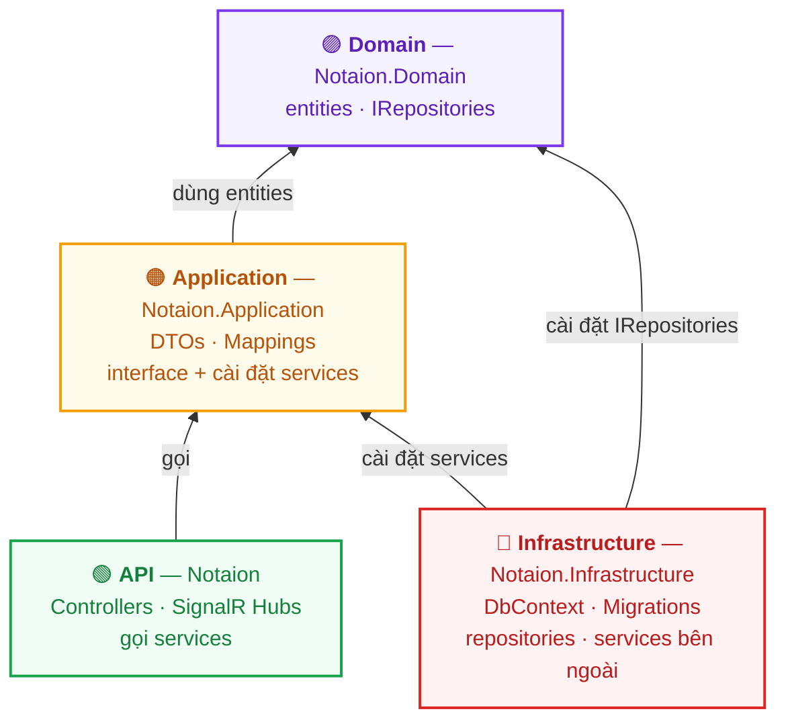
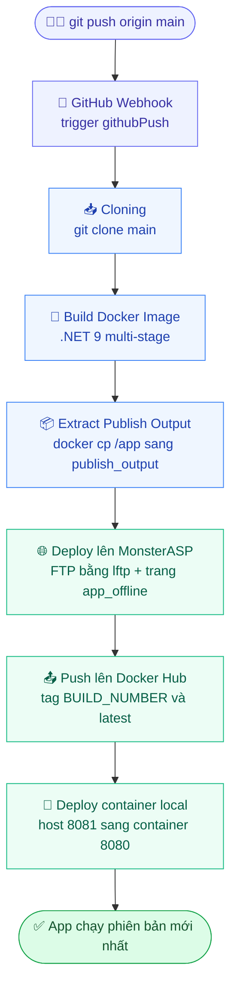

[English](README.md) | 🌐 **Tiếng Việt**

# 🗒️ Notaion Backend

> Nền tảng **ghi chú & chat** thời gian thực lấy cảm hứng từ Notion — Web API **ASP.NET Core 9** xây dựng theo **Clean Architecture**, đóng gói bằng **Docker** và triển khai qua pipeline CI/CD **Jenkins**.

[](https://coderabbit.ai)
[](https://github.com/mtai0524/notaion-backend/actions/workflows/main_my-chat-console.yml)


---

## ✨ Tính năng

- 📝 **Trang kiểu Notion** — trang lồng nhau, item và theo dõi lượt truy cập trang
- 📅 **Ghi chú hằng ngày** cộng tác thời gian thực, đính kèm ảnh/file dán trực tiếp
- 💬 **Chat thời gian thực** — phòng nhóm và trò chuyện riêng qua SignalR
- 👥 **Bạn bè** — lời mời kết bạn và quan hệ bạn bè
- 🔔 **Thông báo** đẩy theo thời gian thực
- 🤖 **Chatbot AI & bộ nhớ** dùng ML.NET
- 📎 **Tải lên ảnh & file** qua Cloudinary
- 🔐 **Xác thực** — ASP.NET Identity, JWT Bearer, OpenID Connect và OAuth **Discord** (liên kết/huỷ liên kết provider)
- 📊 **Phân tích** và 🩺 **kiểm tra sức khỏe (health check)**

---

## 🏛️ Clean Architecture

Phụ thuộc luôn hướng **vào trong**: lớp ngoài phụ thuộc lớp trong, và **Domain** ở lõi không phụ thuộc vào bất cứ thứ gì.



| Lớp | Project | Trách nhiệm |
|---|---|---|
| 🟣 **Domain** | `Notaion.Domain` | Entities, enums và interface repository (`IRepositories`). Lõi — không phụ thuộc gì. |
| 🟠 **Application** | `Notaion.Application` | Use case: DTOs, mappings, interface services và phần cài đặt. |
| 🔴 **Infrastructure** | `Notaion.Infrastructure` | `DbContext`, migration EF Core, cài đặt repository + service bên ngoài, Identity. |
| 🟢 **API** | `Notaion` | Controller HTTP, SignalR hub, filter — điểm vào kết nối mọi thứ lại với nhau. |

<details>
<summary>📷 Sơ đồ vẽ tay gốc (nguồn của diagram Mermaid ở trên)</summary>


</details>

---

## 🧱 Cấu trúc dự án

```
NotaionWebApp/
├── Notaion/                       # 🟢 API — Controllers, SignalR Hubs, Filters, Attributes
├── Notaion.Application/           # 🟠 Application — Services, Interfaces, DTOs, Mappings, Hubs
├── Notaion.Domain/                # 🟣 Domain — Entities, Enums, Interfaces (IRepositories)
├── Notaion.Infrastructure/        # 🔴 Infrastructure — DbContext, Migrations, Repositories, Identity
├── Notion.Aspire.AppHost/         # Host điều phối .NET Aspire
└── Notion.Aspire.ServiceDefaults/ # Service defaults dùng chung của Aspire
```

---

## 🛠️ Công nghệ sử dụng

| Mảng | Công nghệ |
|---|---|
| Runtime | .NET 9 · ASP.NET Core Web API |
| Thời gian thực | SignalR (hub chat & ghi chú) |
| Dữ liệu | EF Core 9 · SQL Server |
| Xác thực | ASP.NET Identity · JWT Bearer · OpenID Connect · Discord OAuth |
| AI / ML | Microsoft.ML (ML.NET) |
| Media | Cloudinary |
| Tài liệu API | Swagger · NSwag · Scalar |
| Điều phối | .NET Aspire |
| Container | Docker (multi-stage) |
| CI/CD | Jenkins (chính) · GitHub Actions |

---

## 🚀 CI/CD

Mỗi lần push lên `main` sẽ kích hoạt pipeline **Jenkins** (qua GitHub webhook): build Docker image, deploy lên **MonsterASP.NET** qua FTP, đẩy image lên **Docker Hub**, và cuối cùng chạy container mới ở local.

### Luồng pipeline



### Các stage trong pipeline

| # | Stage | Làm gì | Công cụ |
|---|---|---|---|
| 1 | **Cloning** | Clone nhánh `main` từ GitHub | `git` |
| 2 | **Build Docker Image** | Build .NET 9 multi-stage, gắn tag `:BUILD_NUMBER` + `:latest` | Docker |
| 3 | **Extract Publish Output** | Copy `/app` từ image ra `publish_output/` | `docker cp` |
| 4 | **Deploy to MonsterASP** | Upload trang bảo trì `app_offline.htm`, FTP-mirror output, rồi xoá trang offline | `lftp` |
| 5 | **Push to Docker Hub** | Push `:BUILD_NUMBER` và `:latest` lên `mtaidev/notaion-backend` | Docker Hub |
| 6 | **Deploy Local Container** | Dừng/xoá container cũ, chạy image mới ở host port `8081` | Docker |
| 🔁 | **post** | `success` → in URL · `failure` → báo build lỗi · `always` → dọn dẹp + `docker image prune` | Jenkins |

### Kiểm tra deploy

Endpoint `DeployInfo` cho biết build, version và thời điểm deploy đang chạy:

```
http://localhost:8081/api/DeployInfo/info       # container local
http://notaion.runasp.net/api/DeployInfo/info   # MonsterASP
```

```json
{
  "status": "✅ Running",
  "deployedAt": "2026-05-21 15:30:00",
  "buildNumber": "11",
  "version": "11",
  "environment": "Production"
}
```

> 📖 **Hướng dẫn cài đặt đầy đủ:** [jenkins-docker-guide.vi.md](jenkins-docker-guide.vi.md) — cài Jenkins bằng Docker Compose, cấu hình credentials, `Jenkinsfile` hoàn chỉnh và troubleshooting.

> ℹ️ Có thêm một workflow **GitHub Actions** phụ ([`main_my-chat-console.yml`](.github/workflows/main_my-chat-console.yml)) cũng build, test và deploy lên MonsterASP qua WebDeploy.

---

## ⚡ Bắt đầu (local)

```bash
# 1) Chạy trực tiếp API
cd NotaionWebApp/Notaion
dotnet restore
dotnet run

# 2) …hoặc build & chạy bằng Docker
docker build -t notaion-backend .
docker run -d -p 8081:8080 --name notaion-backend notaion-backend
# → http://localhost:8081
```

Về pipeline triển khai Jenkins + Docker + MonsterASP, xem [hướng dẫn CI/CD](jenkins-docker-guide.vi.md).
