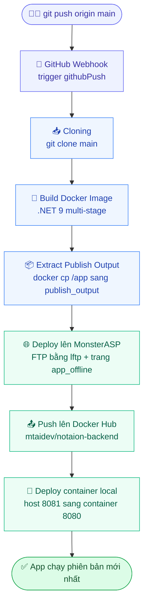

[English](jenkins-docker-guide.md) | 🌐 **Tiếng Việt**

# 🚀 Jenkins + Docker + MonsterASP — Hướng dẫn CI/CD

> Cập nhật lần cuối: 04/06/2026 — Project: notaion-backend (.NET 9)

---

## 📋 Mục lục

1. [Kiến trúc tổng quan](#kiến-trúc-tổng-quan)
2. [Yêu cầu](#yêu-cầu)
3. [Cài đặt Jenkins bằng Docker Compose](#cài-đặt-jenkins-bằng-docker-compose)
4. [Cấu hình Jenkins lần đầu](#cấu-hình-jenkins-lần-đầu)
5. [Dockerfile cho .NET 9](#dockerfile-cho-net-9)
6. [Jenkinsfile hoàn chỉnh](#jenkinsfile-hoàn-chỉnh)
7. [Giải thích các stage](#giải-thích-các-stage)
8. [Credentials trong Jenkins](#credentials-trong-jenkins)
9. [API kiểm tra deploy](#api-kiểm-tra-deploy)
10. [Lệnh Docker hữu ích](#lệnh-docker-hữu-ích)
11. [Troubleshooting](#troubleshooting)

---

## Kiến trúc tổng quan



> Lưu ý: deploy lên MonsterASP dùng **FTP (lftp)**, không phải WebDeploy. Pipeline lấy file publish từ Docker image rồi mirror qua FTP, có bật trang bảo trì `app_offline.htm` trong lúc deploy.

---

## Yêu cầu

| Công cụ | Phiên bản |
|---|---|
| Docker Desktop | 24.x trở lên |
| Docker Compose | v2.x trở lên |
| PowerShell | 7.x (pwsh) |

```powershell
docker --version
docker compose version
```

---

## Cài đặt Jenkins bằng Docker Compose

### Bước 1 — Tạo thư mục và file compose

```powershell
mkdir C:\jenkins-docker
cd C:\jenkins-docker
notepad docker-compose.yml
```

Nội dung `docker-compose.yml`:

```yaml
version: '3.8'

services:
  jenkins:
    image: jenkins/jenkins:lts
    container_name: jenkins
    restart: always
    ports:
      - "8080:8080"
      - "50000:50000"
    volumes:
      - jenkins_home:/var/jenkins_home
      - /var/run/docker.sock:/var/run/docker.sock

volumes:
  jenkins_home:
```

### Bước 2 — Khởi chạy Jenkins

```powershell
docker compose up -d
```

### Bước 3 — Lấy mật khẩu admin lần đầu

```powershell
docker exec jenkins cat /var/jenkins_home/secrets/initialAdminPassword
```

### Bước 4 — Cài Docker CLI, lftp và zip vào Jenkins container

```powershell
docker exec -u root jenkins bash -c "apt-get update && apt-get install -y docker.io lftp zip"
docker exec -u root jenkins chmod 666 /var/run/docker.sock
```

### Bước 5 — Truy cập Jenkins

Mở trình duyệt: **http://localhost:8080**

---

## Cấu hình Jenkins lần đầu

1. Nhập mật khẩu admin từ bước 3
2. Chọn **"Install suggested plugins"**
3. Tạo tài khoản admin
4. Cài thêm plugins:

```
Manage Jenkins → Plugins → Available plugins

✅ GitHub Integration Plugin
✅ Docker Pipeline
✅ SSH Agent Plugin
```

---

## Dockerfile cho .NET 9

Tạo file `Dockerfile` ở **root repo** (cùng cấp `Jenkinsfile`):

```dockerfile
FROM mcr.microsoft.com/dotnet/aspnet:9.0 AS base
WORKDIR /app
EXPOSE 80

FROM mcr.microsoft.com/dotnet/sdk:9.0 AS build
WORKDIR /src
COPY . .
WORKDIR "/src/NotaionWebApp/Notaion"
RUN dotnet restore "Notaion.csproj"
RUN dotnet build "Notaion.csproj" -c Release -o /app/build

FROM build AS publish
WORKDIR "/src/NotaionWebApp/Notaion"
RUN dotnet publish "Notaion.csproj" -c Release -o /app/publish

FROM base AS final
WORKDIR /app
COPY --from=publish /app/publish .
ENTRYPOINT ["dotnet", "Notaion.dll"]
```

---

## Jenkinsfile hoàn chỉnh

Khớp với file [`Jenkinsfile`](Jenkinsfile) thực tế ở root repo.

```groovy
pipeline {
    agent any

    environment {
        DOCKER_HUB_USER = 'mtaidev'
        IMAGE_NAME      = 'notaion-backend'
        IMAGE_TAG       = "${BUILD_NUMBER}"
        CONTAINER_NAME  = 'notaion-backend'
        APP_PORT        = '8081'
        FTP_HOST        = 'site8642.siteasp.net'
        FTP_REMOTE_DIR  = '/wwwroot'
        PUBLISH_DIR     = '/var/jenkins_home/workspace/notaion-backend/publish_output'
    }

    triggers {
        githubPush()
    }

    stages {

        stage('Cloning') {
            steps {
                echo '📥 Đang clone source code...'
                git branch: 'main',
                    credentialsId: '3ceb09c4-d257-4d6b-b65c-26db994addff',
                    url: 'https://github.com/mtai0524/notaion-backend.git'
            }
        }

        stage('Build Docker Image') {
            steps {
                echo '🐳 Đang build Docker image...'
                sh """
                    docker build -t ${DOCKER_HUB_USER}/${IMAGE_NAME}:${IMAGE_TAG} .
                    docker tag ${DOCKER_HUB_USER}/${IMAGE_NAME}:${IMAGE_TAG} \
                               ${DOCKER_HUB_USER}/${IMAGE_NAME}:latest
                """
            }
        }

        stage('Extract Publish Output') {
            steps {
                echo '📦 Lấy files publish từ Docker image...'
                sh """
                    rm -rf ${PUBLISH_DIR}
                    docker create --name temp_extract ${DOCKER_HUB_USER}/${IMAGE_NAME}:latest
                    docker cp temp_extract:/app ${PUBLISH_DIR}
                    docker rm temp_extract
                    echo "✅ Files publish:"
                    ls -la ${PUBLISH_DIR}
                """
            }
        }

        stage('Deploy to MonsterASP (FTP)') {
            steps {
                echo '🌐 Đang deploy lên MonsterASP qua FTP...'
                withCredentials([usernamePassword(
                    credentialsId: 'monsterasp-ftp-creds',
                    usernameVariable: 'FTP_USER',
                    passwordVariable: 'FTP_PASS'
                )]) {
                    sh '''
                        echo '<html><body><h1>Deploying, please wait...</h1></body></html>' \
                            > /tmp/app_offline.htm

                        lftp -u "$FTP_USER","$FTP_PASS" ftp://site8642.siteasp.net <<LFTP
set ssl:verify-certificate no
set ftp:ssl-allow yes
set ftp:passive-mode on
set ftp:prefer-epsv no
set net:max-retries 5
set net:timeout 60
set xfer:clobber yes
set mirror:parallel-transfer-count 2
put /tmp/app_offline.htm -o /wwwroot/app_offline.htm
mirror -R --delete --continue --no-perms --exclude app_offline.htm /var/jenkins_home/workspace/notaion-backend/publish_output /wwwroot
rm -f /wwwroot/app_offline.htm
bye
LFTP

                        echo "✅ FTP deploy hoàn tất!"
                    '''
                }
            }
        }

        stage('Push to Docker Hub') {
            steps {
                echo '📤 Đang push image lên Docker Hub...'
                withCredentials([usernamePassword(
                    credentialsId: 'dockerhub-creds',
                    usernameVariable: 'DOCKER_USER',
                    passwordVariable: 'DOCKER_PASS'
                )]) {
                    sh """
                        echo \$DOCKER_PASS | docker login -u \$DOCKER_USER --password-stdin
                        docker push ${DOCKER_HUB_USER}/${IMAGE_NAME}:${IMAGE_TAG}
                        docker push ${DOCKER_HUB_USER}/${IMAGE_NAME}:latest
                    """
                }
            }
        }

        stage('Deploy Container (local)') {
            steps {
                echo '🚀 Đang chạy container local...'
                sh """
                    docker stop ${CONTAINER_NAME} || true
                    docker rm   ${CONTAINER_NAME} || true
                    docker run -d \
                        --name ${CONTAINER_NAME} \
                        --restart always \
                        -p ${APP_PORT}:8080 \
                        -e BUILD_NUMBER=${BUILD_NUMBER} \
                        -e "DEPLOY_TIME=\$(date '+%Y-%m-%d %H:%M:%S')" \
                        -e APP_VERSION=${IMAGE_TAG} \
                        ${DOCKER_HUB_USER}/${IMAGE_NAME}:latest
                """
            }
        }
    }

    post {
        success {
            echo "✅ Deploy thành công! Build #${BUILD_NUMBER}"
            echo "🌐 Local:      http://localhost:${APP_PORT}/api/DeployInfo/info"
            echo "🌐 MonsterASP: http://notaion.runasp.net/api/DeployInfo/info"
        }
        failure {
            echo "❌ Deploy thất bại tại Build #${BUILD_NUMBER} - Kiểm tra log!"
        }
        always {
            echo '🧹 Dọn dẹp...'
            sh """
                rm -rf ${PUBLISH_DIR}
                docker image prune -f
            """
        }
    }
}
```

---

## Giải thích các stage

| # | Stage | Làm gì | Công cụ |
|---|---|---|---|
| 1 | **Cloning** | Clone nhánh `main` từ GitHub | `git` |
| 2 | **Build Docker Image** | Build .NET 9 multi-stage, gắn tag `:BUILD_NUMBER` + `:latest` | Docker |
| 3 | **Extract Publish Output** | `docker create` container tạm rồi `docker cp` `/app` vào `PUBLISH_DIR` | `docker cp` |
| 4 | **Deploy to MonsterASP (FTP)** | Put `app_offline.htm`, `lftp mirror -R --delete` output lên `/wwwroot`, rồi xoá trang offline | `lftp` |
| 5 | **Push to Docker Hub** | `docker login` rồi push `:BUILD_NUMBER` và `:latest` | Docker Hub |
| 6 | **Deploy Container (local)** | Dừng/xoá container cũ, `docker run` image mới ở host `8081` → container `8080` | Docker |
| 🔁 | **post.success** | In URL `DeployInfo` của local + MonsterASP | Jenkins |
| 🔁 | **post.failure** | Báo số build bị lỗi | Jenkins |
| 🔁 | **post.always** | Xoá `PUBLISH_DIR` và chạy `docker image prune -f` | Jenkins |

---

## Credentials trong Jenkins

```
Manage Jenkins → Credentials → System → Global credentials → Add Credentials
```

| ID | Kind | Username | Dùng cho |
|---|---|---|---|
| `dockerhub-creds` | Username/Password | `mtaidev` | Push Docker Hub |
| `monsterasp-ftp-creds` | Username/Password | `site8642` | Deploy MonsterASP qua FTP |
| `3ceb09c4-…addff` | Username/Password (GitHub) | — | Clone repo private |

---

## API kiểm tra deploy

Thêm `DeployInfoController.cs` vào project:

```csharp
[ApiController]
[Route("api/[controller]")]
public class DeployInfoController : ControllerBase
{
    [HttpGet("info")]
    public IActionResult GetDeployInfo()
    {
        return Ok(new
        {
            status      = "✅ Running",
            deployedAt  = Environment.GetEnvironmentVariable("DEPLOY_TIME") ?? "unknown",
            buildNumber = Environment.GetEnvironmentVariable("BUILD_NUMBER") ?? "unknown",
            version     = Environment.GetEnvironmentVariable("APP_VERSION") ?? "1.0.0",
            environment = Environment.GetEnvironmentVariable("ASPNETCORE_ENVIRONMENT") ?? "Production"
        });
    }
}
```

Gọi API kiểm tra:
```
http://localhost:8081/api/DeployInfo/info
http://notaion.runasp.net/api/DeployInfo/info
```

Kết quả mẫu:
```json
{
  "status": "✅ Running",
  "deployedAt": "2026-05-21 15:30:00",
  "buildNumber": "11",
  "version": "11",
  "environment": "Production"
}
```

---

## Lệnh Docker hữu ích

```powershell
# Khởi động Jenkins
docker compose up -d

# Dừng Jenkins
docker compose down

# Xem log Jenkins
docker logs -f jenkins

# Xem log app
docker logs -f notaion-backend

# Xem trạng thái container
docker ps

# Vào trong container Jenkins (cài thêm tool)
docker exec -u root -it jenkins bash

# Cài docker cli, lftp và zip vào Jenkins (chạy 1 lần)
docker exec -u root jenkins bash -c "apt-get update && apt-get install -y docker.io lftp zip"
docker exec -u root jenkins chmod 666 /var/run/docker.sock

# Dọn dẹp images không dùng
docker image prune -f

# Dọn dẹp toàn bộ
docker system prune -f
```

---

## Troubleshooting

### Jenkins không tìm thấy docker
```powershell
docker exec -u root jenkins bash -c "apt-get update && apt-get install -y docker.io"
docker exec -u root jenkins chmod 666 /var/run/docker.sock
```

### Jenkins không tìm thấy lftp
```powershell
docker exec -u root jenkins apt-get install -y lftp
```

### FTP deploy bị treo hoặc timeout
```
# Đảm bảo có các cấu hình passive mode + EPSV trong block lftp:
set ftp:passive-mode on
set ftp:prefer-epsv no
set net:max-retries 5
set net:timeout 60
```

### App không truy cập được
```powershell
# Kiểm tra port app đang lắng nghe
docker logs notaion-backend

# Nếu app lắng nghe 8080, map đúng port
docker run -p 8081:8080 mtaidev/notaion-backend:latest
```

### DEPLOY_TIME có dấu cách làm vỡ lệnh docker run
```groovy
// Dùng dấu ngoặc kép bao quanh giá trị -e
-e "DEPLOY_TIME=\$(date '+%Y-%m-%d %H:%M:%S')"
```

### Reset mật khẩu admin Jenkins
```powershell
docker exec jenkins cat /var/jenkins_home/secrets/initialAdminPassword
```

---

*Tài liệu được giữ đồng bộ với setup thực tế của project notaion-backend.*
